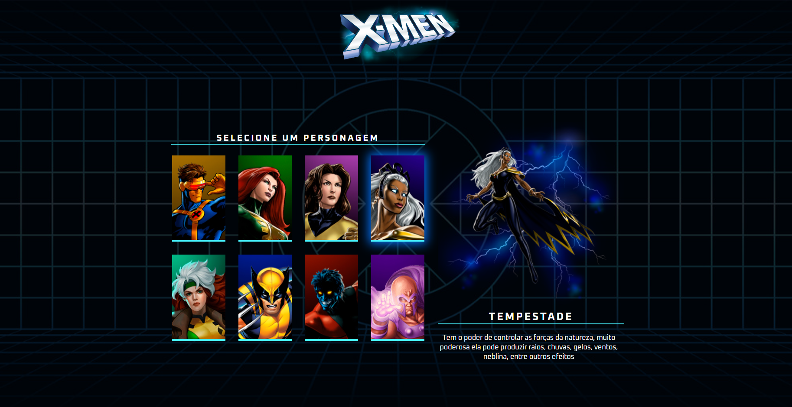

<!--### Olá, eu sou o Bruno Soffo 👋 -->

  

 

 

<!--

  <a href="https://github.com/BrunoSoffo">
  
  

-->

  
   
  

    
 

  
   
  
  
   
   
   

  
 

### Some of my projects:

<table>
    <thead align="center">
        <tr>
            <td>Tom's Landing Page</td>
            <td>X-Men Website</td>           
            <td>DevSteam</td>
        </tr>
    </thead>
    <tr>
        <td>
            
        </td>
        <td>
            
        </td> 
        <td>
            
        </td>               
    </tr>
</table>
 
 
<h2 align="center" style="color: yellow;">Thanks for visiting my profile.</h2>

  

<!--
**BrunoSoffo/BrunoSoffo** is a ✨ _special_ ✨ repository because its `README.md` (this file) appears on your GitHub profile.

Here are some ideas to get you started:

- 🔭 I’m currently working on ...
- 🌱 I’m currently learning ...
- 👯 I’m looking to collaborate on ...
- 🤔 I’m looking for help with ...
- 💬 Ask me about ...
- 📫 How to reach me: ...
- 😄 Pronouns: ...
- ⚡ Fun fact: ...
-->
